# Project: Cooking Recipe assistant

Note: I submitted this project too to see how many points it'd get

<p align="center">
  
</p>

# Recipe Assistant Project

In the current times we live in, we have less and less time to cook. Many times, we deprive ourselves of eating better due to a lack of knowledge or not knowing how to search for recipes in an immense ocean of content.

However, there are creators of cooking content on YouTube. Much of this content consists of recipe videos that usually do not take much time, are not very difficult, and are quite healthy. It is well known that Mediterranean cuisine is among the best in the world, with many of these recipes being both delicious and nutritious.

Among the many channels, I highlight one that I have been following for a long time called ["La Cocina de Masito."](https://www.youtube.com/@lacocinademasito) The creator of this channel has hundreds of recipe videos featuring distinctive types of food, which provides a wide variety of options. Generally, his videos range from 4 to 20 minutes.

## Project Objectives
- Create a dataset of Mediterranean cooking recipes from video transcripts.
- Clean up syntactical and semantic errors specific to YouTube videos, then translate the transcripts from Spanish to English.
- Orchestrate data ingestion into Elasticsearch using Prefect.
- Create a RAG cooking recipe assistant application using Elasticsearch and OpenAI or Ollama as the LLM.
- Qualitatively and quantitatively evaluate the RAG application to validate its performance.
- Create a graphical interface for the conversational agent using Streamlit that allows users to ask questions.


## Project overview

The Cooking Recipe Assistant is a RAG application designed to assist users in preparing Mediterranean cuisine recipes. Among the main steps of use, we have:

- **Ingredient Selection**: Provide the ingredients needed to prepare a recipe.
- **Categorization of Meals**: Provide information about recipes that belong to different food groups.
- **Tips**: Offer tricks or tips for preparing a recipe.
- **Recipe Instructions**: Sequential steps to prepare the recipe.
- **Conversational Interaction**: Make Mediterranean cuisine recipes available to users without the need to search for information on the web or YouTube videos.


## Technologies

- Python 3.10.12
- [Prefect](Prefect) is a workflow orchestration tool designed to simplify the construction, execution, and monitoring of data pipelines.
- Docker and Docker Compose for containerization
- [ElasticSearch](https://www.elastic.co/guide/en/elasticsearch/reference/current/docker.html) for full-text search and vectorstore
- Streamlit as the UI interface (see [Streamlit Documentation](https://docs.streamlit.io/) for more information on Streamlit)
- [Grafana](https://grafana.com/) for monitoring and PostgreSQL as the backend for it
- [OpenAI](https://openai.com/) as an LLM or [Ollama](https://ollama.com/) as opensource LLM locally.
- [LangChain](https://www.langchain.com/) is a library that simplifies the integration of language models into applications, allowing the creation of complex interactions and access to external data.
- [Pipenv](https://pipenv.pypa.io/en/latest/) is a tool for managing dependencies in Python projects, combining the functionalities of pip and virtualenv.


## Dataset

## Overview

To build the dataset, we used the transcripts from the YouTube channel "La Cocina de Masito." Given that the channel has hundreds of videos, the following restrictions will be considered:

- Videos will have a duration between 4.9 and 20 minutes. Longer videos may exist due to collaborations with other creators. Shorts that have minimal transcriptions will also be filtered out.
- The channel has playlists, with each playlist representing a food category. A total of 14 playlists will be used, with a maximum of 60 videos downloaded per playlist.
- A video may belong to multiple playlists, and duplicates must be controlled.
- Older videos may not have automatic transcription enabled.

The playlists used to build the dataset are as follows:
- [Stews and Soups](https://www.youtube.com/playlist?list=PLoyFGpU_IasVb0QvKn2IgbPZ_gKNGzP7Z)
- [Pasta](https://www.youtube.com/playlist?list=PLoyFGpU_IasWzT5nS-qF-gI2K5eJURRsV)
- [Rice Dishes](https://www.youtube.com/playlist?list=PLoyFGpU_IasX1xkQfxcAw3alSibGj3Mg_)
- [Meats and Poultry](https://www.youtube.com/playlist?list=PLoyFGpU_IasXD955aZhg9aZ9_UPtGIrE4)
- [Christmas Recipes](https://www.youtube.com/playlist?list=PLoyFGpU_IasUmRDsq3r_M9rqZcrtH4im5)
- [Fish and Seafood](https://www.youtube.com/playlist?list=PLoyFGpU_IasW79W_MepAt_26tGxsNeSrA)
- [Salads](https://www.youtube.com/playlist?list=PLoyFGpU_IasXtIMsfqUIjveH-2ZaU-Ddi)
- [Vegetables](https://www.youtube.com/playlist?list=PLoyFGpU_IasWdF-U6YNvgflikUKRDiUHi)
- [Baked Fish](https://www.youtube.com/playlist?list=PLoyFGpU_IasX6Ag6gT6y6jKGtuKQpvjT0)
- [Traditional Desserts](https://www.youtube.com/playlist?list=PLoyFGpU_IasX60n70ruTpxWLGW3leXgKJ)
- [Roasts](https://www.youtube.com/playlist?list=PLoyFGpU_IasU6BaX0dpoVn3M1PG86zBmr)
- [Legumes](https://www.youtube.com/playlist?list=PLoyFGpU_IasWERZIVJi_6T_YAbAfHKB3r)
- [Cold Cakes](https://www.youtube.com/playlist?list=PLoyFGpU_IasXVrTgZp2qvlKyLYIE7qdt2)

### Data Ingestion Workflow

The data ingestion workflow is composed of three phases:

- **Data Downloading**: Information is downloaded from both the playlists and the video transcripts.
- **Preprocessing**: In this step, syntactical and semantic errors are removed. Additionally, an information extraction process is performed.
- **Indexing**: The cleaned dataset is inserted into an index in Elasticsearch.


The code for the ingestion process is located in the directory

```bash
ls -lh cooking_recipe_assistant/ingestion
total 48K
-rw-rw-rw- 1 aztleclan aztleclan 9,4K oct 23 17:54 es_indexing.py
-rw-rw-rw- 1 aztleclan aztleclan 9,3K oct 23 01:49 generate_dataset.py
-rw-rw-rw- 1 aztleclan aztleclan 4,6K oct 28 14:33 ingestion_pipeline.py
-rw-rw-rw- 1 aztleclan aztleclan    0 oct  6 13:04 __init__.py
-rw-rw-rw- 1 aztleclan aztleclan 9,2K oct 23 16:50 preprocess_data.py
```

The parameter configuration of the different tasks that make up the Prefect pipeline are described in the file:

```bash
ls -lh cooking_recipe_assistant/config/prefect
total 4,0K
-rw-rw-rw- 1 aztleclan aztleclan 2,2K oct 28 17:08 config.yaml
```

<p align="center">
  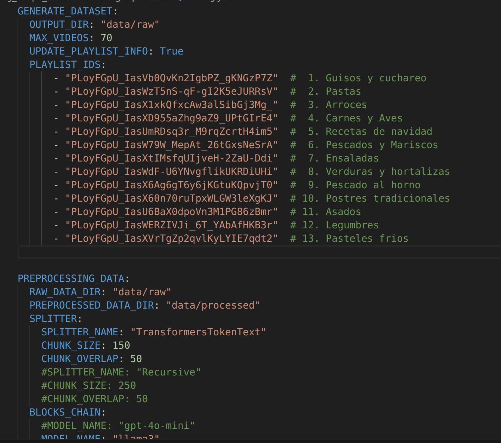
</p>

### Data Downloading

The task of downloading the transcripts is defined in the `generate_dataset.py` module. This task downloads the raw data to the `data/raw/documents/` directory in json format and the production lists are formed in the `playlist_info.pkl` and `video_playlist_map.pkl` files in `data/raw/info/` directory. Below is a sample of the downloaded data:


```bash
ls -lh data/raw/
total 28K
drwxrwxr-x 2 aztleclan aztleclan  20K oct 20 20:02 documents
drwxrwxr-x 2 aztleclan aztleclan 4,0K oct 18 16:11 info
```

```bash
ls -lh data/raw/info/
total 32K
-rw-rw-r-- 1 aztleclan aztleclan 2,2K oct 20 23:04 playlist_info.pkl
-rw-rw-r-- 1 aztleclan aztleclan  25K oct 20 23:04 video_playlist_map.pkl
```

```bash
ls -lh data/raw/documents/ | head -5
total 16M
-rw-rw-r-- 1 aztleclan aztleclan  58K oct 20 19:28 086AnjxzAfg.json
-rw-rw-r-- 1 aztleclan aztleclan  22K oct 12 22:46 0FvFQ4DhGg8.json
-rw-rw-r-- 1 aztleclan aztleclan  28K oct 20 20:00 0hCPrxRRMdU.json
-rw-rw-r-- 1 aztleclan aztleclan  48K oct 18 16:46 0iZUayL1RQ0.json
```


### Preprocessing

The task of preprocessing the transcripts is defined in the `preprocess_data.py` module. This task basically uses two llms to perform cleaning and information extraction tasks.

- **Cleaning llm**. This llm uses a template to eliminate syntactical and semantic errors, as well as eliminating errors typical of YouTube videos such as filler words.
- **Extraction llm**. This llm uses a template to extract ingredients, a brief description, cooking instructions and a list of tips from a clean transcription of a recipe. In addition, it improves the original title because it may have syntactical errors and/or suffer from clickbait.


Finally, since the recipe instructions text may exceed the size of the vectors, a chunking technique was chosen. To do this, we will first count the number of tokens resulting from the text and with that information the best splitter will be selected.

For the recipe instructions text, the number of tokens with `tiktoken` with the encoding `cl100k_base` was counted, the results can be shown in the following graph:

<p align="center">
  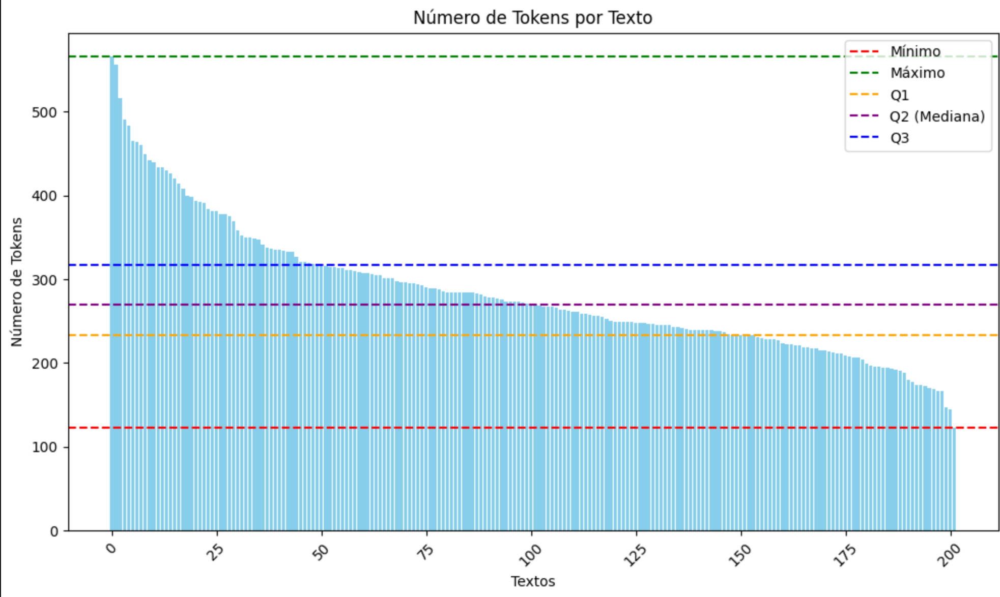
</p>

Different splitters were tested and the `TransformersTokenText` splitter was selected with a `CHUNK_SIZE: 150` and `CHUNK_OVERLAP: 50` configuration. The number of document chunks can be seen in the following graph.

<p align="center">
  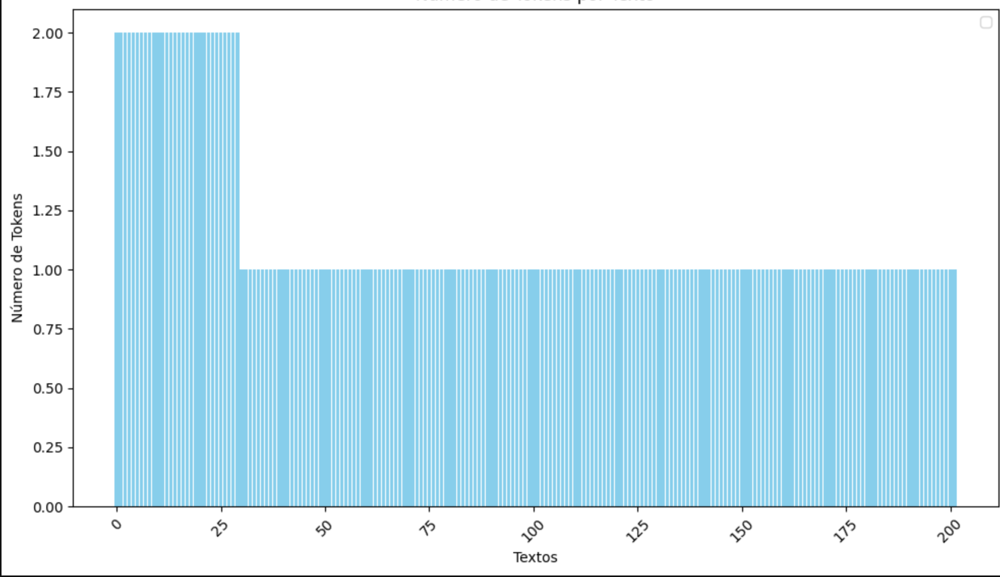
</p>

As can be seen with this configuration, the number of chunks greater than 1 is relatively small compared to the total.


The cleaned and preprocessed data will be saved in json documents in the directory:

```bash
ls -lh data/processed/documents/ | head -5
total 944K
-rw-rw-r-- 1 aztleclan aztleclan 3,3K oct 23 17:55 086AnjxzAfg.json
-rw-rw-r-- 1 aztleclan aztleclan 3,0K oct 23 17:55 0iZUayL1RQ0.json
-rw-rw-r-- 1 aztleclan aztleclan 3,1K oct 23 17:55 0X7I-vr2oaM.json
-rw-rw-r-- 1 aztleclan aztleclan 3,1K oct 23 17:55 1WAbPmolGqY.json
```

### Indexing
The task of indexing the transcripts is defined in the `preprocess_data.py` module. This module will read the preprocessed documents stored in the `data/processed/documents/` directory and index them in Elasticsearch. Because hybrid search and hybrid rrf are used, `all-MiniLM-L6-v2` will be used as embedding which generates vectors with dimension 384. The field that will be used as vector is the text of the chunk.

Because a chunking technique is used, the document id will be formed by the doc_id (YouTube video id) and the chunk number separated by the '@' character. For example, `XBLKVwmJ2wg@001`.

# 
```bash
ls -lh cooking_recipe_assistant/ingestion
```

The index configuration is shown below.

<p align="center">
  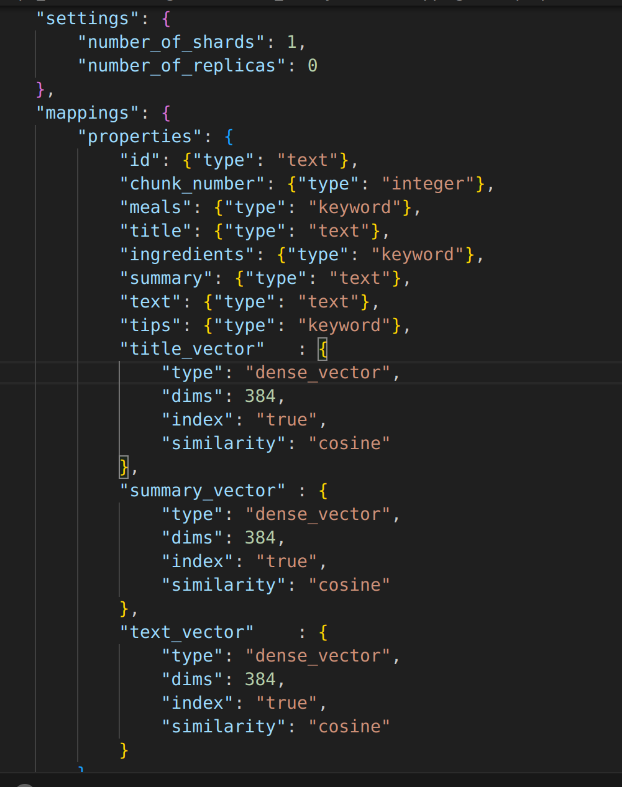
</p>


### Running

Elasticsearch is configured within a docker compose so it is necessary to start it first to be able to ingest the data into the index. Starting docker compose:

```bash
docker-compose up -d
```


In order to use Prefect Cloud you need to register with [Prefect](https://www.prefect.io/).
Once logged into Prefect Cloud the next step is to generate an API Key as indicated in this [link](https://docs.prefect.io/3.0/manage/cloud/manage-users/api-keys).

The following figure shows the screen where the API-KEYs are managed.

<p align="center">
  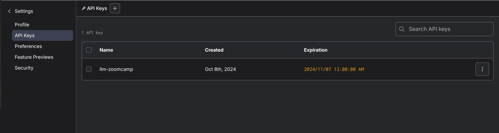
</p>


Install Prefect:
```bash
pipenv install prefect
```

Activate the environment:

```bash
pipenv shell
```

Log in to Prefect Cloud Use your API token to log in:

```bash
prefect cloud login --key YOUR_API_TOKEN
```

Register the Flow Run the following command in your terminal to register the flow with Prefect Cloud:

```bash
prefect deployment run 'cooking-recipe-ingestion-flow/cooking-recipe-ingestion-deployment' \
       --param config_path=cooking_recipe_assistant/config/prefect/config.yaml
```

```bash
python -m cooking_recipe_assistant.ingestion.ingestion_pipeline
```

To see the results you must access Prefect Cloud and go to the "Flows" section and access the most recent execution as shown in the following images.

<p align="center">
  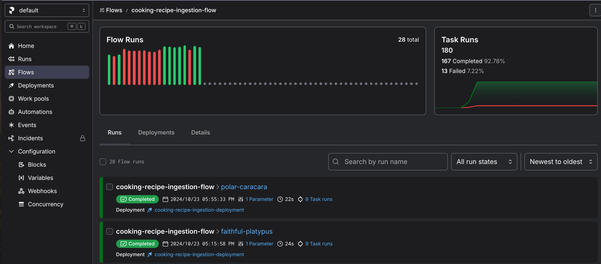
</p>


<p align="center">
  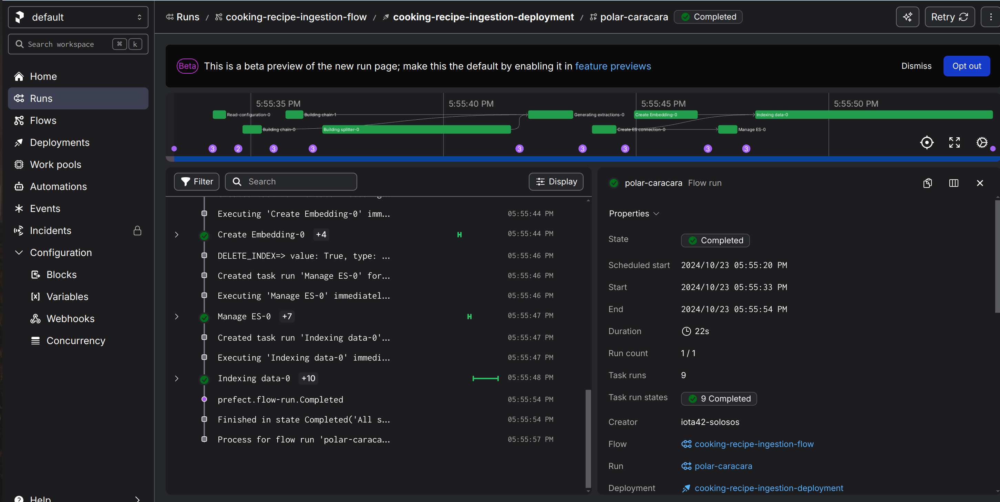
</p>


### Dataset Description

The dataset used in this project contains information about
various exercises, including:

- **doc_id**: Video identifier of Youtube
- **Meals**: Categories in which the recipe can be classified. For example, soups, rice, fish, desserts, etc.
- **Title**: Name of the recipe.
- **Ingredients**: List of ingredients used in the preparation of the recipe.
- **Summary**: Short description (2-3 sentences) of the recipe.
- **chunk_number**: Chunk numbre
- **Text**: Detailed steps to make the recipe.
- **Tips**: Useful tips for carrying out the recipe. For example, cooking times, difficulty, cold dishes, etc.


<p align="center">
  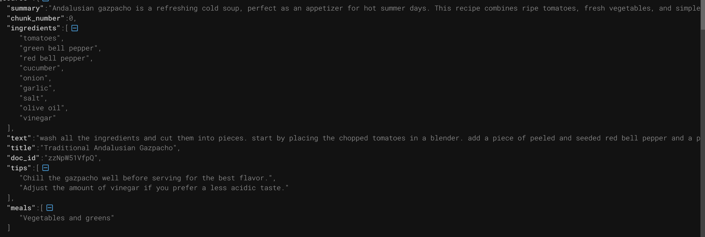
</p>


## Ground truth

To generate the ground-truth, the notebook `generate-ground-true.ipynb` was used, which is in the notebooks directory.

```bash
pipenv shell
cd notebooks/
jupyter lab
```

To generate the ground-truth the llm ollama was used. For debugging purposes the responses generated by the llm were saved in the following directory

```bash
ls -lh data/test/ground_truth/generated/questions/ | head -5
total 928K
-rw-r--r-- 1 aztleclan aztleclan  681 oct 25 16:51 086AnjxzAfg@000.txt
-rw-r--r-- 1 aztleclan aztleclan  830 oct 25 16:34 0iZUayL1RQ0@000.txt
-rw-r--r-- 1 aztleclan aztleclan  747 oct 25 16:43 0X7I-vr2oaM@000.txt
-rw-r--r-- 1 aztleclan aztleclan  745 oct 25 16:47 1WAbPmolGqY@000.txt
```

The generated ground-truth is composed of 1160 questions. The five questions were generated for each of the 232 cooking recipes. The generated ground-truth is saved in the following path:

```bash
ls -lh data/test/ground_truth/ground-truth-retrieval.csv 
-rw-rw-r-- 1 aztleclan aztleclan 169K oct 26 23:21 data/test/ground_truth/ground-truth-retrieval.csv

```

A sample of the result is shown below


| ID                  | Doc ID           | Chunk Number | Number | Question                                                            |
|---------------------|------------------|--------------|--------|---------------------------------------------------------------------|
| erjXeb0Hscw@000     | erjXeb0Hscw      | 0            | 1      | How do I achieve crispy and golden bacon for my breakfast?         |
| erjXeb0Hscw@000     | erjXeb0Hscw      | 0            | 2      | What is the recommended size of cheese cubes for melting?          |
| erjXeb0Hscw@000     | erjXeb0Hscw      | 0            | 3      | Can I cook the spaghetti longer than eight minutes?                |
| erjXeb0Hscw@000     | erjXeb0Hscw      | 0            | 4      | How do I enhance the creaminess of the cheese in my dish?         |
| erjXeb0Hscw@000     | erjXeb0Hscw      | 0            | 5      | Is my Creamy Spaghetti with Cheese and Bacon cooked properly?      |


## Dataset restoration

The dataset is stored in the file data_recipe.zip. Unzip this file with the following command.

```bash
unzip data_recipe.zip
```

## Retrieval Evaluation 

The ground-truth is composed of 1160 questions. To carry out this assessment, this set was divided into two sub-counts:
- **Training**: 928(80.0%)
- **Validation**: 232(20.0%)

To perform the retrieval evaluation experiments, the `evaluation-text.ipynb` notebook in the `notebooks` directory was used. To use this notebook, the following steps must be performed:

```bash
pipenv shell
cd notebooks/
jupyter lab
```

Three approaches were used: lexical search (bm25), hybrid search and hybrid rrf. For the lexical approach, boosting was used on the textual fields. Meanwhile, in the hybrid and hybrid rff approaches, combined boosting of the textual fields and the vector search was used. In both cases, the hyperopt library was used to search for the best values.

The results of the experiments are shown in the following table:

| Method              | Base Train MRR | Base Valid MRR | Boost Train MRR | Boost Valid MRR |
|---------------------|----------------|----------------|------------------|------------------|
| es_hybrid           | 0.894289       | 0.889440       | **0.919468**     | **0.907759**     |
| es_hybrid_rrf       | 0.889458       | 0.884914       | 0.908369         | 0.898563         |
| es_bm25             | 0.879005       | 0.871193       | 0.893337         | 0.879023         |


Given the previous results, it can be seen that the best results have been obtained with the **hybrid** approach.


## RAG flow evaluation

To perform the RAG flow evaluation experiments, the `evaluation-rag.ipynb` notebook in the `notebooks` directory was used. To use this notebook, the following steps must be performed:


```bash
pipenv shell
cd notebooks/
jupyter lab
```

To carry out the evaluations, three models were used with a hybrid search configuration with boosting, which was the one that gave us the best metrics in the previous evaluation. On the other hand, for the llama 3 and gpt-4o-mini models, the total set of 1,160 ground-truth questions was used. While for the gpt-4o model, only 700 ground-truth questions were used due to billing issues.

The results of the experiments are shown in the following table:

| Relevance          | Llama3         | GPT-4O Mini    | GPT-4O        |
|--------------------|----------------|----------------|---------------|
| RELEVANT           | 0.491379       | **0.881897**   | 0.777143      |
| PARTLY RELEVANT    | 0.316379       | **0.100000**   | 0.204286      |
| NON RELEVANT       | 0.192241       | **0.018103**   | 0.018571      |

Given the previous results, it can be seen that the best results were obtained with the gpt-4o-mini model.


## Preparation

Since we use OpenAI, you need to provide the API key:

1. Install `direnv`. If you use Ubuntu, run `sudo apt install direnv` and then `direnv hook bash >> ~/.bashrc`.
2. Copy `.envrc_template` into `.envrc` and insert your key there.
3. For OpenAI, it's recommended to create a new project and use a separate key.
4. Run `direnv allow` to load the key into your environment.

For dependency management, we use pipenv, so you need to install it:

```bash
pip install pipenv
```

Once installed, you can install the app dependencies:

```bash
pipenv install --dev
```

## Running the application


### Database configuration

Before the application starts for the first time, the database
needs to be initialized.

First, run `postgres`:

```bash
docker-compose up postgres
```

Then run the [`db_prep.py`](cooking_recipe_assistant/database/db_prep.py) script:

```bash
pipenv shell

export POSTGRES_HOST=localhost

python -m cooking_recipe_assistant.database.db_prep
```


To check the contents of the database use [DBeaver Community](https://dbeaver.io/). dbeaver offers an easy to use graphical interface.

### Running with Docker-Compose

The easiest way to run the application is with `docker-compose`:

```bash
docker-compose up
```

### Running locally

If you want to run the application locally,
start only postres and grafana:

```bash
docker-compose up -d postgres grafana
```

If you previously started all applications with
`docker-compose up`, you need to stop the `app`:

```bash
docker-compose stop app
```

Now run the app on your host machine:

```bash
pipenv shell

export POSTGRES_HOST=localhost

cd cooking_recipe_assistant && \
   streamlit run app.py
```

### Running with Docker (without compose)

Sometimes you might want to run the application in
Docker without Docker Compose, e.g., for debugging purposes.

First, prepare the environment by running Docker Compose
as in the previous section.

Next, build the image:

```bash
docker build -t cooking-recipe-assistant:3.10.12-slim . 
```

Make sure you have the OPENAI_API_KEY environment variable set and run it:

```bash
docker run -it --rm \
    --network="zoomcamp-llm_default" \
    --env-file=".env" \
    -e OPENAI_API_KEY=${OPENAI_API_KEY} \
    -e ENV_DEPLOYMENT=compose \
    -e DATA_PATH="data/data.csv" \
    -p 8501:8501 \
    cooking-recipe-assistant:3.10.12-slim
```

### Time configuration

When inserting logs into the database, ensure the timestamps are
correct. Otherwise, they won't be displayed accurately in Grafana.

When you start the application, you will see the following in
your logs:

```
Database timezone: Etc/UTC
Database current time (UTC): 2024-08-24 06:43:12.169624+00:00
Database current time (Europe/Berlin): 2024-08-24 08:43:12.169624+02:00
Python current time: 2024-08-24 08:43:12.170246+02:00
Inserted time (UTC): 2024-08-24 06:43:12.170246+00:00
Inserted time (Europe/Berlin): 2024-08-24 08:43:12.170246+02:00
Selected time (UTC): 2024-08-24 06:43:12.170246+00:00
Selected time (Europe/Berlin): 2024-08-24 08:43:12.170246+02:00
```

Make sure the time is correct.

You can change the timezone by replacing `TZ` in `.env`.

On some systems, specifically WSL, the clock in Docker may get
out of sync with the host system. You can check that by running:

```bash
docker run ubuntu date
```

If the time doesn't match yours, you need to sync the clock:

```bash
wsl

sudo apt install ntpdate
sudo ntpdate time.windows.com
```

Note that the time is in UTC.

After that, start the application (and the database) again.


## Architecture

The code for the application is in the [`cooking_recipe_assistant/`](cooking_recipe_assistant//) folder:

- [`app.py`](cooking_recipe_assistant/app.py) - Modulo con la aplicación streamlit.
- [`rags/rag.py`](cooking_recipe_assistant/rags/rag.py) - the main RAG logic for building the retrieving the data and building the prompt
- [`ingestion/ingestion_pipeline.py`](cooking_recipe_assistant/ingestion/ingestion_pipeline.py) - loading the data into the knowledge base
- [`cooking_recipe_assistant/rags/retrievers/es_bm25.py`](cooking_recipe_assistant/rags/retrievers/es_bm25.py) - Lexical search approach for elasticsearch.
- [`cooking_recipe_assistant/rags/retrievers/es_hybrid.py`](cooking_recipe_assistant/rags/retrievers/es_hybrid.py`) - Hybrid search approach for elasticsearch.
- [`cooking_recipe_assistant/rags/retrievers/es_hybrid_rrf.py`](cooking_recipe_assistant/rags/retrievers/es_hybrid_rrf.py) - Hybrid rrf search approach for elasticsearch.
- [`database/db.py`](cooking_recipe_assistant/database/db.py) - the logic for logging the requests and responses to postgres
- [`database/db_prep.py`](cooking_recipe_assistant/database/db_prep.py) - the script for initializing the database
- [`cooking_recipe_assistant/evaluation/metrics.py`](cooking_recipe_assistant/evaluation/metrics.py) - Optimization metrics.
- [`cooking_recipe_assistant/evaluation/optimization.py`](cooking_recipe_assistant/evaluation/optimization.py) - Optimization with hyperopt.
- [`cooking_recipe_assistant/evaluation/retrievers.py`](cooking_recipe_assistant/evaluation/retrievers.py) - Elasticsearch Evaluators.


The configuration for the application is in the [`cooking_recipe_assistant/`](cooking_recipe_assistant/conf/) folder:

- [`es/es_index.json`](cooking_recipe_assistant/config/es/es_index.json) - Elasticsearch index configuration
- [`prefect/config.yaml`](cooking_recipe_assistant/config/prefect/config.yaml) - Setting up pipeline tasks with Prefect
- [`prompts/`](cooking_recipe_assistant/config/prompts/) - Directory with prompt templates.
- [`streamlit/`](cooking_recipe_assistant/config/streamlit/) - Streamlit Configuration Files.

## Experiments

For experiments, we use Jupyter notebooks.
They are in the [`notebooks`](notebooks/) folder.

To start Jupyter, run:

```bash
pipenv shell

cd notebooks

jupyter notebook
```

We have the following notebooks:

- [`evaluation-rag.ipynb`](notebooks/evaluation-rag.ipynb): RAG flow evaluation.
- [`evaluation-text.ipynb`](notebooks/evaluation-text.ipynb): Retrieval Evaluation.
- [`generate-ground-true.ipynb`](notebooks/generate-ground-true.ipynb): Notebook for the ground-truth generation.
- [`load-data-grafana.ipynb`](notebooks/load-data-grafana.ipynb): Notebook for loading data into Grafana.
- [`flow-rag.ipynb`](notebooks/flow-rag.ipynb): Notebook simple RAG.
- [`chunking-test.ipynb`](notebooks/chunking-test): Notebook for testing various chunking approaches.


## GUI with Streamlit

In order to interact with the RAG, a graphical interface developed with Streamlit has been created.


### Docker-compose


Starting docker-compose
```bash
docker-compose up -d
```

Access the GUI through the following url: [`http://localhost:8501/`](http://localhost:8501/). The following home screen will then be displayed.


<p align="center">
  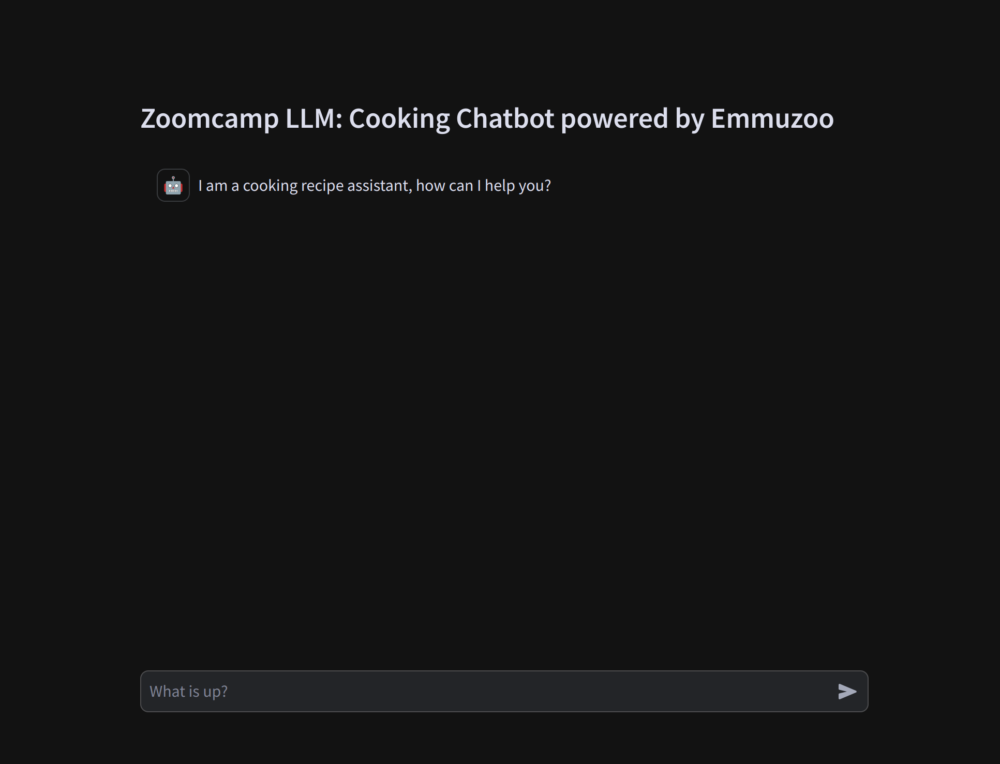
</p>

In the input you can write a question. FOnce the user types a question, the RAG system will generate a response and save the request statistics in the database. For example, for the question "How do I achieve crispy and golden bacon for my Creamy Spaghetti with Cheese and Bacon?" the result is shown in the following screen.

<p align="center">
  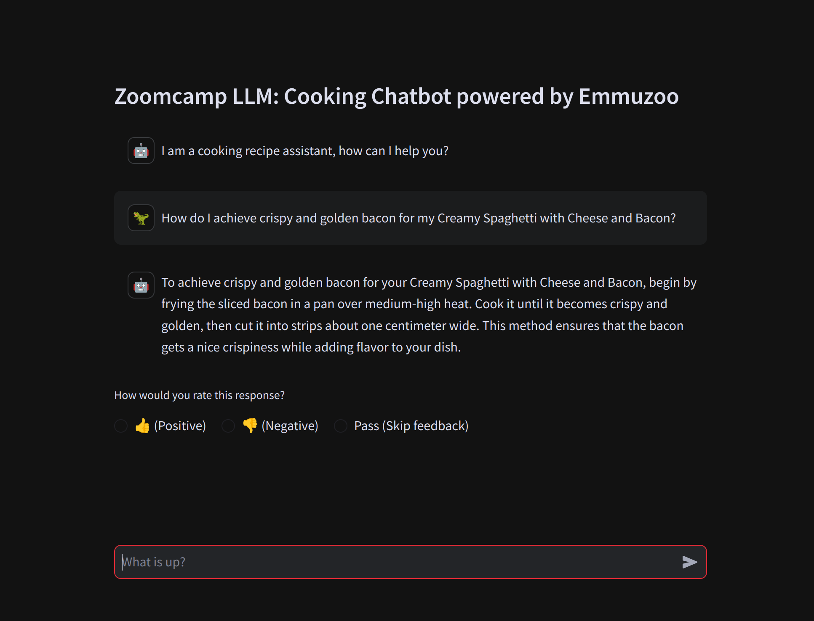
</p>

After the RAG system returns the answer and displays it on the screen, a feedback option for the user with three options will also be displayed. For positive or negative feedback from the user, this information is saved in the database. Once any of the options are clicked or a new question is written, the feedback will disappear.

<p align="center">
  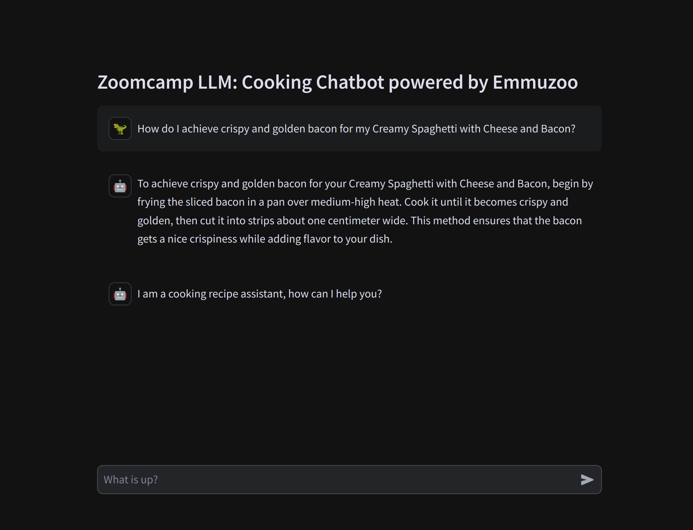
</p>


### local

The way of use is similar to when we just start them with docker-compose.
Starting postgres grafana, and elasticsearch

```bash
docker-compose up postgres grafana elasticsearch
```

```bash
pipenv shell

export POSTGRES_HOST=localhost

cd cooking_recipe_assistant && \
   streamlit run app.py
```


## Monitoring

We use Grafana for monitoring the application. 

It's accessible at [localhost:3000](http://localhost:3000):

- Login: "YOUR_USER"
- Password: "YOUR_PASSWORD"

### Dashboards

<p align="center">
  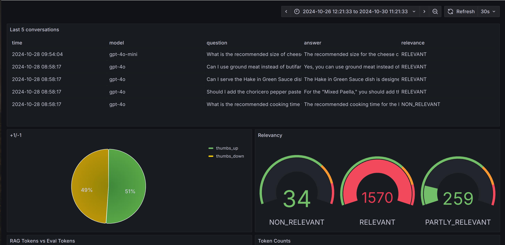
</p>

<p align="center">
  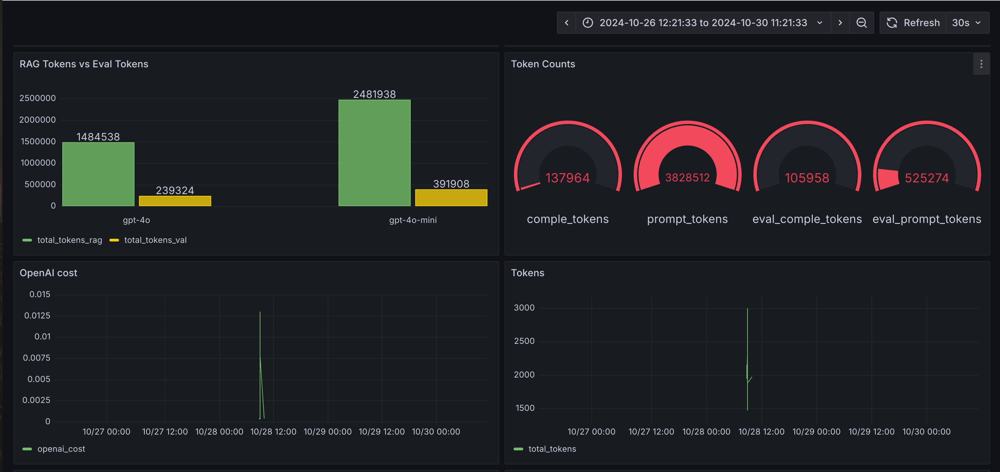
</p>

<p align="center">
  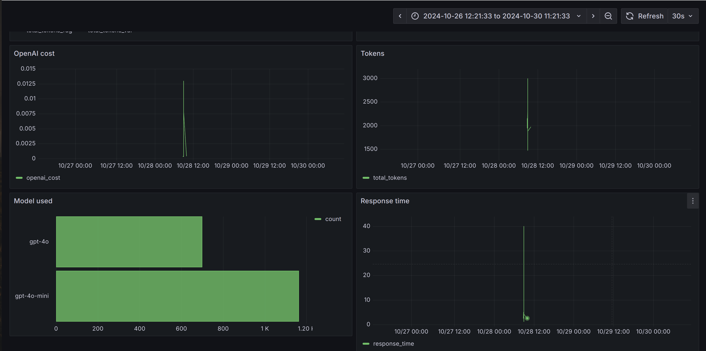
</p>

The monitoring dashboard contains several panels:

- **Last 5 Conversations (Table):** Displays a table showing the five most recent conversations, including details such as the question, answer, relevance, and timestamp. This panel helps monitor recent interactions with users.
- **+1/-1 (Pie Chart):** A pie chart that visualizes the feedback from users, showing the count of positive (thumbs up) and negative (thumbs down) feedback received. This panel helps track user satisfaction.
- **Relevancy (Gauge):** A gauge chart representing the relevance of the responses provided during conversations. The chart categorizes relevance and indicates thresholds using different colors to highlight varying levels of response quality.
- **Rag Token vs Eval Token**. This chart shows the total number of tokens for the RAG and the evaluator for each type of LLM model used.
- **Token Counts**. This chart shows the number of completion tokens and tokens for the RAG and the evaluator.s
- **OpenAI Cost (Time Series):** A time series line chart depicting the cost associated with OpenAI usage over time. This panel helps monitor and analyze the expenditure linked to the AI model's usage.
- **Tokens (Time Series):** Another time series chart that tracks the number of tokens used in conversations over time. This helps to understand the usage patterns and the volume of data processed.
- **Model Used (Bar Chart):** A bar chart displaying the count of conversations based on the different models used. This panel provides insights into which AI models are most frequently used.
- **Response Time (Time Series):** A time series chart showing the response time of conversations over time. This panel is useful for identifying performance issues and ensuring the system's responsiveness.

### Setting up Grafana

Configure the connection to the postgresql database manually. The dashboards route configuration is specified in the following path:

`grafana/provisioning/dashboards/grafana_dashboards.yaml`

While the dashboard is located at the following route:

`grafana/dashboards/Cooking-Recipe-Assistant-Dashboard-v2.json`

To load the data, use the `load-data-grafana.ipynb` notebook that loads data into Postgres to be able to view the dashboards with a history of the RAG.
